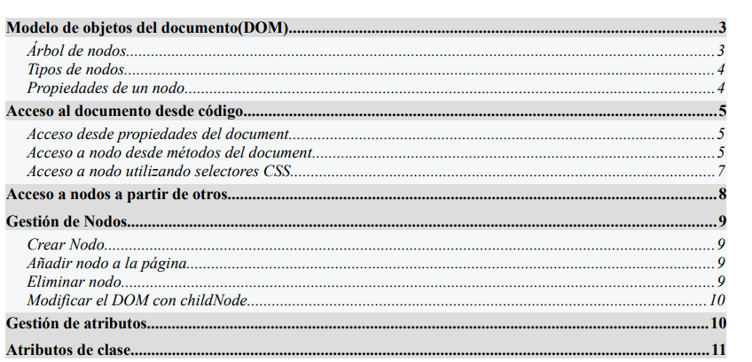
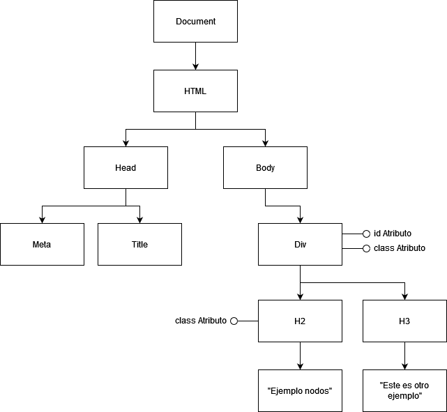
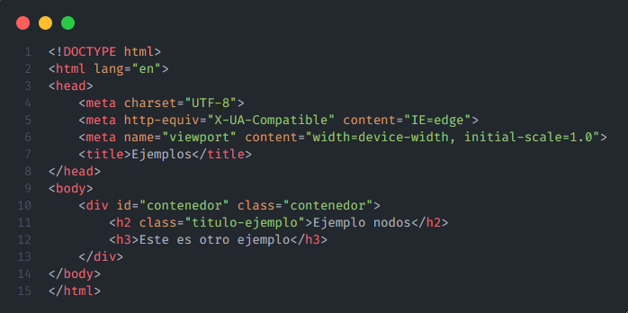

# DOM-DWEC

## Índice

La profe propone como índice del proyecto uno como este:

## Modelo de objetos del documento (DOM)

DOM (Document Object Model) es una API definida para representar y interacturar con cualquier documento HTML.

El DOM representa el documento como un árbol de nodos, donde cada nodo representa una parte del mismo.

### Árbol de nodos

Un ejemplo de árbol de nodos sería algo como esto:

Que en HTML sería algo como:

### Tipos de nodos

Hay diferentes tipos de nodos:

- **Document**: nodo raíz del que derivan los demás nodos del árbol.
- **Element**: nodos definidos por etiquetas HTML, puede contener atributos y de él pueden derivar otros nodos.
- **Attr**: nodo que representa cada uno de los atributos de las etiquetas HTML. Aunque con JS no lo vemos como nodos sino como información asociada al nodo de tipo *element*.
- **Text**: el texto dentro de un nodo *element* se considera un nodo de tipo *text*.
- **Comment**: representa los comentarios incluidos en el documento HTML.

### Bibliografía

- [DOM](https://www.freecodecamp.org/espanol/news/que-es-el-dom-el-significado-del-modelo-de-objeto-de-documento-en-javascript/)
- [MDN](https://developer.mozilla.org/en-US/docs/Web/API/Document_Object_Model)
- [Introducción DOM MDN](https://developer.mozilla.org/en-US/docs/Web/API/Document_Object_Model/Introduction)
- [NODOS](https://www.w3.org/2005/03/DOM3Core-es/introduccion.html)
- [TIPOS DE NODOS](https://www.aprenderaprogramar.com/index.php?option=com_content&view=article&id=802:tipos-de-nodos-dom-document-element-text-attribute-comment-arbol-de-nodos-para-javascript-cu01124e&catid=78&Itemid=206)
- [TIPOS DE NODOS](https://uniwebsidad.com/libros/javascript/capitulo-5/tipos-de-nodos)
- [XC](https://lenguajejs.com/javascript/dom/que-es/)